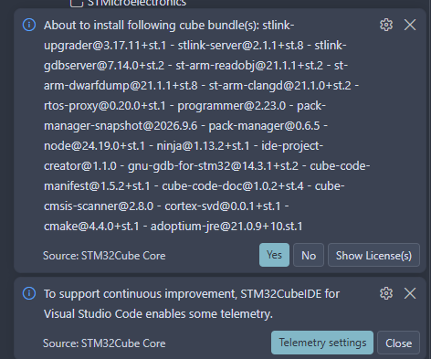
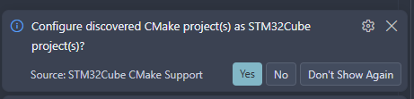
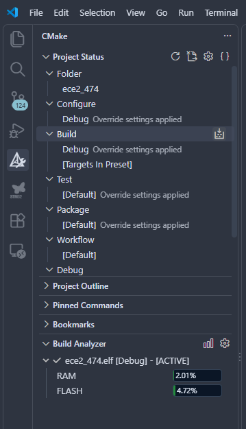

# STM32 기초 실습

**실습 보드: NUCLEO-G474RE**

이 저장소를 내려받아 프로그램을 만들고 보드에서 실행한다. 현재 프로그램은 시작할 때 컴퓨터로 `Hello, World!`를 한 번 보낸다.

## 시작하기

1. VS Code의 확장 메뉴에서 **STM32CubeIDE for Visual Studio Code**를 설치한다.
2. 내려받은 폴더에서 [ece2_474.code-workspace](ece2_474.code-workspace)를 연다.
3. 아래 알림이 나오면 **Yes**를 누른다. 설치 목록에서 `gnu-tools-for-stm32`도 선택한다.

4. 왼쪽 **CMake** 메뉴에서 `Configure` 아래의 `Debug`를 선택한다. 설정이 끝나면 `Build` 오른쪽 버튼을 눌러 프로그램을 만든다.

5. 보드의 **JP5 점퍼가 `5V_STLK` 위치에 꽂혀 있는지 확인**하고, **ST-LINK USB 단자**를 컴퓨터에 연결한다.
6. VS Code 왼쪽 **실행 및 디버그** 메뉴에서 `STM32Cube: Launch ST-Link GDB Server`를 선택하고 **F5**를 누른다.
7. 코드의 `main` 위치에서 멈추면 **F5를 한 번 더** 눌러 실행한다.

## 컴퓨터에서 출력 확인하기

1. VS Code 확장 메뉴에서 **Serial Monitor**를 설치한다. 게시자는 **Microsoft**, 확장 이름은 `ms-vscode.vscode-serial-monitor`다.
2. **Terminal → New Terminal**을 누르고, 아래쪽 패널의 **Serial Monitor** 탭을 연다.
3. Windows **장치 관리자 → 포트(COM 및 LPT)**에서 보드의 포트 번호를 확인한다. 예: `COM5`.
4. Serial Monitor에서 아래 항목을 선택한다.

| 화면의 항목 | 선택할 값 |
|---|---|
| Monitor Mode | **Serial** |
| Port | 장치 관리자에서 확인한 보드의 COM 포트 |
| Baud rate | **9600** |
| View Mode | **Text** |

추가 설정의 `Data bits`는 **8**, `Parity`는 **None**, `Stop bits`는 **1**로 둔다.

5. **Start Monitoring**을 누른다.
6. 보드의 **RESET 버튼**을 누른다. VS Code에서 실행이 멈춰 있다면 F5를 눌러 계속한다.
7. Serial Monitor에 `Hello, World!`가 나오는지 확인한다. 메시지는 시작할 때 한 번만 나온다.

연결을 끝낼 때는 **Stop Monitoring**을 누른다.

## 핀별 용도

| 핀 | 용도 |
|---|---|
| PA2 | 컴퓨터로 데이터 보내기 · 보드 내부에서 USB에 연결됨 |
| PA3 | 컴퓨터가 보낸 데이터 받기 · 보드 내부에서 USB에 연결됨 |
| PA5 | 보드에 있는 LED 켜기·끄기 |
| PA6 | 외부 장치에서 데이터 받기 · SPI |
| PA7 | 외부 장치로 데이터 보내기 · SPI |
| PA13 | 프로그램 다운로드·오류 확인용 연결 |
| PA14 | 프로그램 다운로드·오류 확인용 연결 |
| PB3 | 외부 장치와 데이터를 주고받을 때 타이밍 맞추기 · SPI |
| PB4 | 일정한 주기로 켜짐·꺼짐 신호 출력 · PWM |
| PB6 | 통신할 외부 장치 선택 · SPI |
| PB8 | 외부 장치와 데이터를 주고받을 때 타이밍 맞추기 · I²C |
| PB9 | 외부 장치와 데이터 주고받기 · I²C |
| PC10 | FPGA로 데이터 보내기 · FPGA의 받는 핀에 연결 |
| PC11 | FPGA가 보낸 데이터 받기 · FPGA의 보내는 핀에 연결 |
| PC13 | 보드에 있는 사용자 버튼 입력 |
| GND | FPGA·외부 장치의 GND와 연결 |

컴퓨터 연결과 FPGA 연결은 모두 **9600**으로 사용한다. 외부 장치 연결은 **3.3 V 기준**이다. FPGA 쪽 핀은 해당 실습에서 지정한다.

시간을 재는 기능은 100 ms마다 동작하도록 준비했다. PB4는 1초에 1000번 반복하며, 한 주기의 절반 동안 켜진다. 이 신호는 PA5의 내장 LED와 별개다. 버튼·통신·시간 제어의 실제 동작은 각 주차에 코드를 추가한다.

## 제공 코드 안내

핀·클록·주변장치를 준비하는 기본 코드는 **조교가 CubeMX에서 설정한 뒤 자동 생성한 코드**다. 학생은 CubeMX에서 다시 생성하지 않고 제공된 파일을 그대로 사용한다.

| 파일 | 만든 방식 |
|---|---|
| `main.c`의 초기화 코드 | CubeMX 자동 생성 |
| `stm32g4xx_hal_msp.c`, `stm32g4xx_it.c` | CubeMX 자동 생성 |
| `syscalls.c`, `sysmem.c` | CubeMX 자동 생성 |
| `Drivers/` | ST와 Arm이 제공한 기본 코드 |
| `ece2_474.c`, `ece2_474.h` | 조교가 추가한 실습용 코드 |

**표준 입출력 연결 함수는 조교가 제공한다.** `printf`, `getchar`, `fgets`, `scanf`를 컴퓨터와 연결하는 코드는 [ece2_474.c](Core/Src/ece2_474.c)에 있다. 학생은 이 연결 코드를 그대로 사용하고 실습 동작을 작성하면 된다.

`main.c`를 수정할 때는 `USER CODE BEGIN`과 `USER CODE END` 사이에 작성한다. 이 영역은 CubeMX로 코드를 다시 생성할 때 학생 코드를 보존하기 위한 공간이다. 현재 `Hello, World!` 출력도 이 영역에 추가한 예제다.

## 수정할 파일

- [ece2_474.c](Core/Src/ece2_474.c): 조교 제공 입출력 연결 코드·실습 코드 작성
- [ece2_474.h](Core/Inc/ece2_474.h): 함께 사용할 함수 선언
- [main.c](Core/Src/main.c): 시작할 때 할 일과 반복할 일 작성

## 참고 자료

- [Microsoft Serial Monitor 설치](https://marketplace.visualstudio.com/items?itemName=ms-vscode.vscode-serial-monitor)

- [VS Code 설치 안내](https://www.st.com/resource/en/user_manual/um3512-stm32cubeide-for-visual-studio-code-installation-guide-stmicroelectronics.pdf)
- [필요한 도구 설치 안내](https://dev.st.com/stm32cube-docs/stm32cubeide-vscode/latest/en/docs/markup/basic_concepts/bundles.html)
- [프로그램 만들기·실행하기](https://dev.st.com/stm32cube-docs/stm32cubeide-vscode/latest/en/index.html)
- [보드 설명서·핀 위치](https://www.st.com/resource/en/user_manual/um2505-getting-started-with-stm32g4-series-nucleo64-board-stmicroelectronics.pdf)
- [수업 자료·보고서 안내](https://github.com/Glaysia/ece2_26_2_2)
